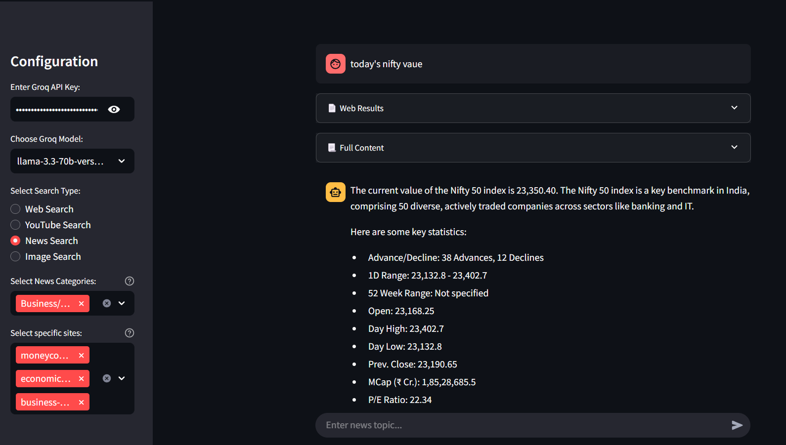

# AI Research Assistant 🔍

[](https://aitiwari-aisearch.streamlit.app/)  


An intelligent research assistant combining web search, news aggregation, YouTube analysis, and image search powered by Groq AI.

👉 [Linkedin demo here ](https://www.linkedin.com/feed/update/urn:li:ugcPost:7309684199974674432/)



## Features 🚀

- **Web Search** with content scraping and summarization  
- **YouTube Video Analysis** with transcript extraction  
- **Smart News Search** with curated source selection  
- **Image Search** with validation and download options  
- **Source Filtering** for news categories  

## Installation ⚙️

1. Clone the repository:
   ```bash
   git clone https://github.com/aitiwari/aisearch.git
   cd aisearch
   ```

2. Install dependencies:
   ```bash
   pip install -r requirements.txt
   ```

## Configuration 🔑

1. Get Groq API key from [Groq Cloud](https://console.groq.com/).  
2. Create a `.env` file:
   ```env
   GROQ_API_KEY=your_api_key_here
   ```

## Usage 🖥️

### Web Search
- Select **Web Search** from the sidebar.
- Enter your research query.
- View summarized results with source links.

### YouTube Analysis
- Select **YouTube Search**.
- Paste a YouTube URL.
- Get the transcript and AI summary.

### News Search
- Select **News Search**.
- Choose categories/sources.
- Enter a news topic.
- Receive filtered news aggregation.

### Image Search
- Select **Image Search**.
- Enter an image description.
- Adjust the number of images.
- Download or view image sources.

## News Sources 📰

| Category                | Example Sources                           |
|-------------------------|-------------------------------------------|
| General News            | Reuters, BBC, NY Times, The Guardian        |
| Technology              | TechCrunch, The Verge, Wired               |
| Artificial Intelligence | OpenAI, DeepMind, VentureBeat              |
| Business/Finance        | Bloomberg, CNBC, Economic Times            |
| Science                 | Nature, ScienceMag, NASA                   |
| Entertainment           | Variety, Billboard, Koimoi                 |

## Customization 🛠️

Add more sources by editing the `NEWS_SOURCES` dictionary:
```python
NEWS_SOURCES = {
    "New Category": [
        "domain1.com",
        "domain2.org"
    ]
}
```
## Acknowledgments 🙏

- Powered by [Groq](https://groq.com/) AI  
- Built with [Streamlit](https://streamlit.io/)  
- Search powered by [DuckDuckGo](https://duckduckgo.com/)

## License 📄

MIT License - See [LICENSE](LICENSE) for details

---

**Disclaimer**: This application is for educational/research purposes only. Use of third-party content is subject to respective source website policies.
```